# Ultimate — Salesforce Service Cloud & Experience Cloud Customer Portal

**A self-service customer support portal built on Salesforce Service Cloud and Experience Cloud, combining a chatbot, case submission, community Q&A, and a searchable knowledge base into one connected support experience.**

> **Note:** "Ultimate" is a fictional company used as the business scenario for this project, built to demonstrate a realistic Service Cloud + Experience Cloud implementation. The Dev org this was built in is no longer active, so this repo documents the finished build through screenshots and a walkthrough presentation rather than deployable metadata.

---

## The business problem

Ultimate was facing declining customer retention driven by poor service quality — slow response times, no way for customers to help themselves, and no central place to find answers. They needed a self-service ecosystem that could deflect simple questions away from live agents while still making it easy to escalate when a customer genuinely needed help.

## The solution

A branded customer community (Experience Cloud site) built around four connected pieces:

| Feature | What it does | Business impact |
|---|---|---|
| **AI chatbot** ("Chat with an Expert") | Greets returning and new visitors, captures contact details before handoff, provides immediate first-line assistance | Reduces wait time for simple questions |
| **Case submission form** (Help Desk) | Structured "Contact Customer Support" form with contact lookup, subject, description, and file upload | Routes real issues into Service Cloud as trackable Cases instead of email/phone |
| **Community Q&A** ("Ask a Question") | Customers post questions publicly; answers become searchable for future visitors | Reduces repeat tickets on common questions over time |
| **Knowledge base** (FAQ) | Featured topic tiles plus a searchable article list, with inline article detail and a "Did this solve your issue?" feedback control | Deflects simple questions before they ever become a Case |

Access is managed through a full self-service registration flow: sign-up, a data-privacy consent step (contact / usage-tracking / location-tracking opt-outs), and standard credential management (login, password reset).

---

## Walkthrough

### 1. Homepage
A single search bar ("How Can We Help?") acts as the entry point to search the knowledge base directly from the homepage.

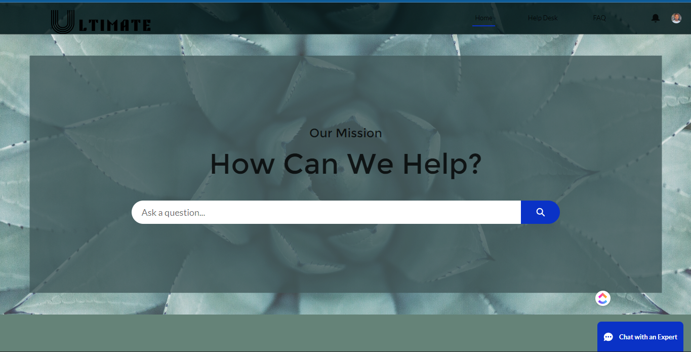

### 2. Chatbot — pre-chat capture
Before connecting a visitor to the chatbot, the widget captures name, email, and subject so context carries into the conversation.

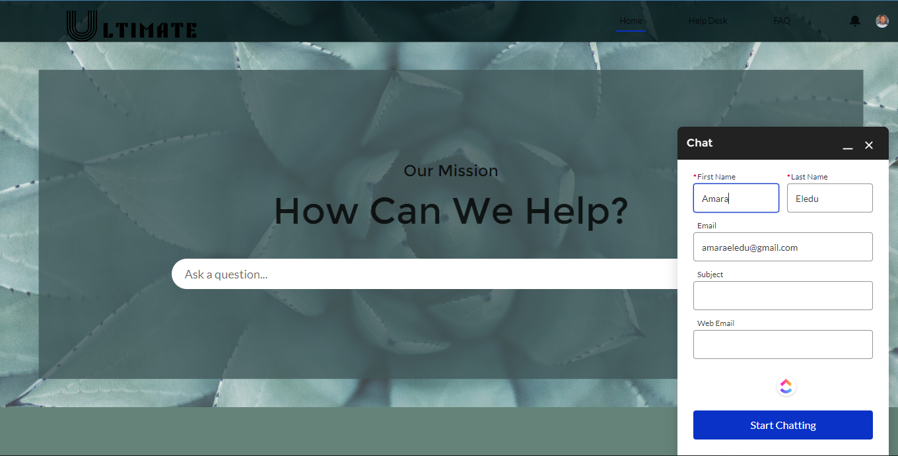

### 3. Chatbot — live conversation
Once submitted, the bot greets the visitor by name and is ready to assist.

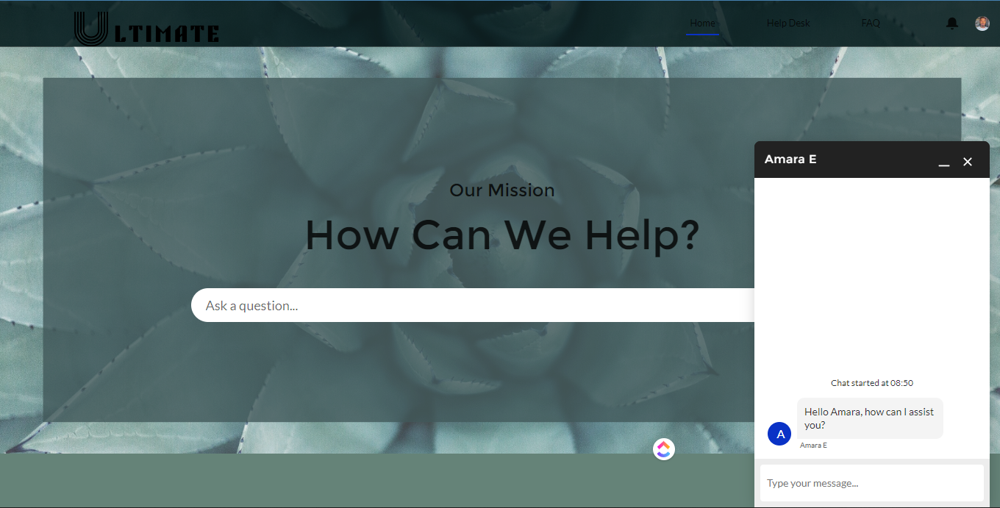

### 4. Help Desk — Case submission
A structured support form (contact lookup, subject, description, file attachment) creates a trackable Service Cloud Case rather than an untracked email.

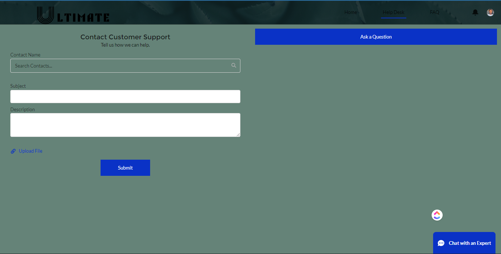

### 5. Help Desk — Ask a Question
Customers can also post a question to the community directly, turning one customer's question into a searchable answer for everyone else.

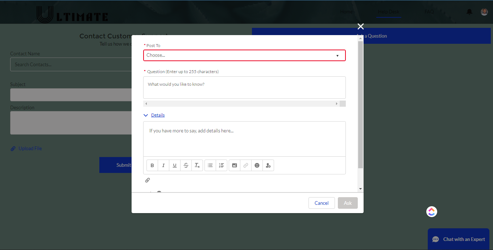

### 6. FAQ / Knowledge base
Featured topic tiles surface the most relevant content, backed by a full searchable article list.

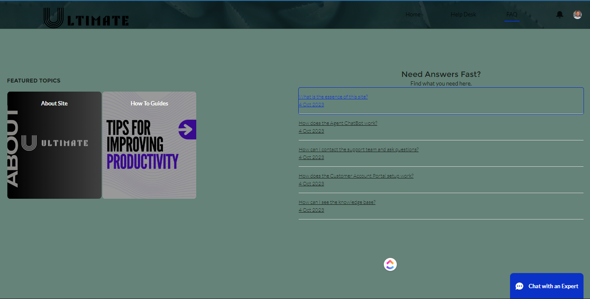

### 7. Knowledge article detail
Clicking an article opens its full content inline, with a one-click "Did this content solve your issue?" feedback control — a simple, direct signal for content quality over time.

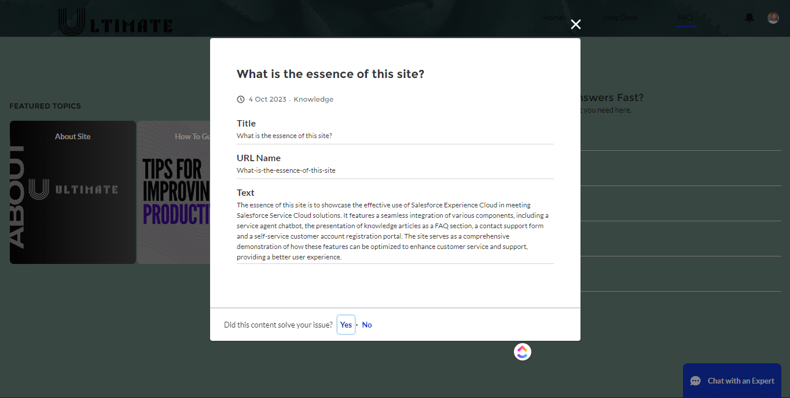

### 8. Login
Separate login paths for customers and employees, with standard password recovery.

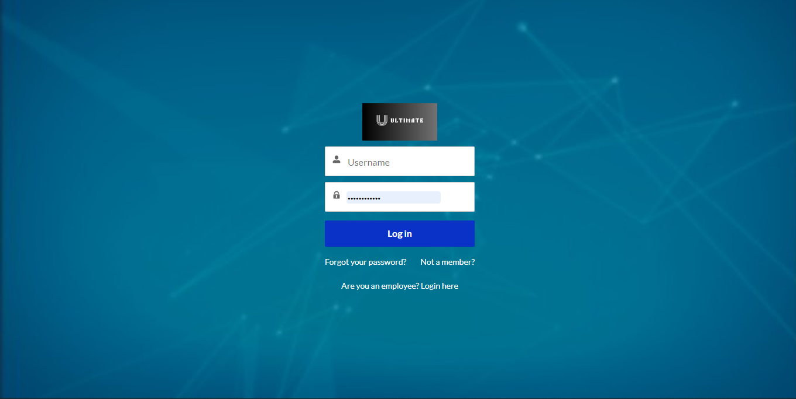

### 9. Self-registration
New customers can self-register for portal access.

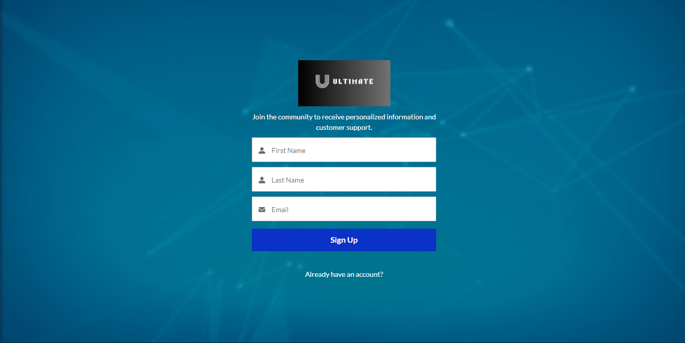

### 10. Privacy preferences
As part of onboarding, new members explicitly set their contact, usage-tracking, and location-tracking preferences — consent captured at the point of registration, not buried in a settings menu later.

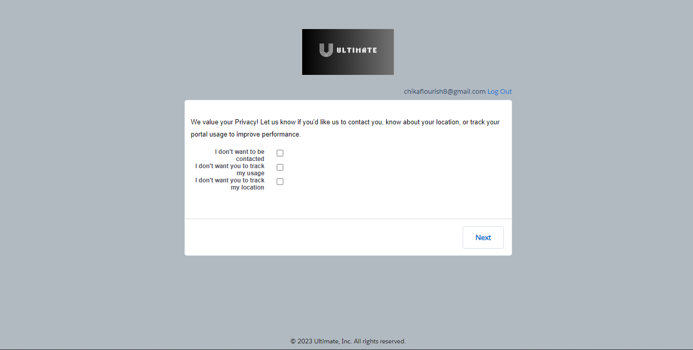

### 11. Registration complete

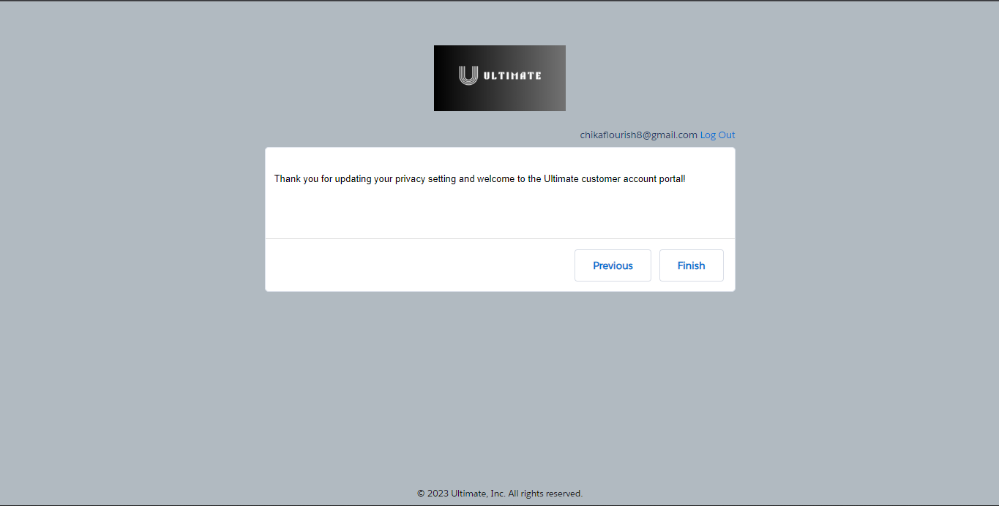

### 12. Password management
Standard self-service password reset with live complexity validation.

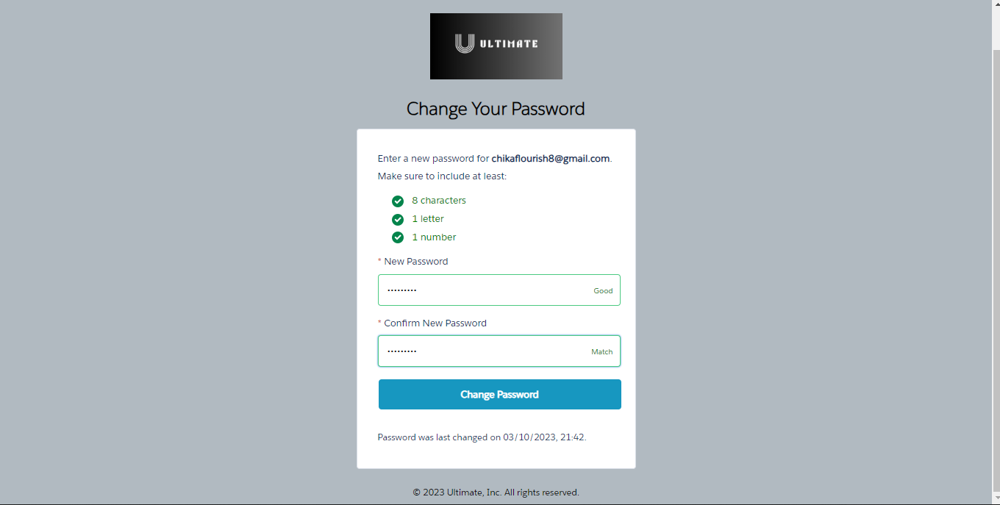

---

## Tech stack

- **Salesforce Service Cloud** — Case management, Knowledge
- **Salesforce Experience Cloud** — customer community, self-registration, login/password flows
- **Embedded Service / Chatbot** — pre-chat capture and live chat widget
- **Chatter Questions & Answers** — the community "Ask a Question" feature
- **Salesforce Knowledge** — FAQ articles with feedback tracking

---

## Full presentation

A complete walkthrough presentation of this project is available here:
[Ultimate — Solution Presentation (Canva)](https://www.canva.com/design/DAGC38Z7hJI/m22swkvGVjj5yNevZONH2Q/view)

---

## About this project

Built to demonstrate a practical, end-to-end Service Cloud and Experience Cloud implementation — covering the full customer journey from anonymous visitor, to registered member, to self-service problem solver, with a live agent escalation path always available underneath.
